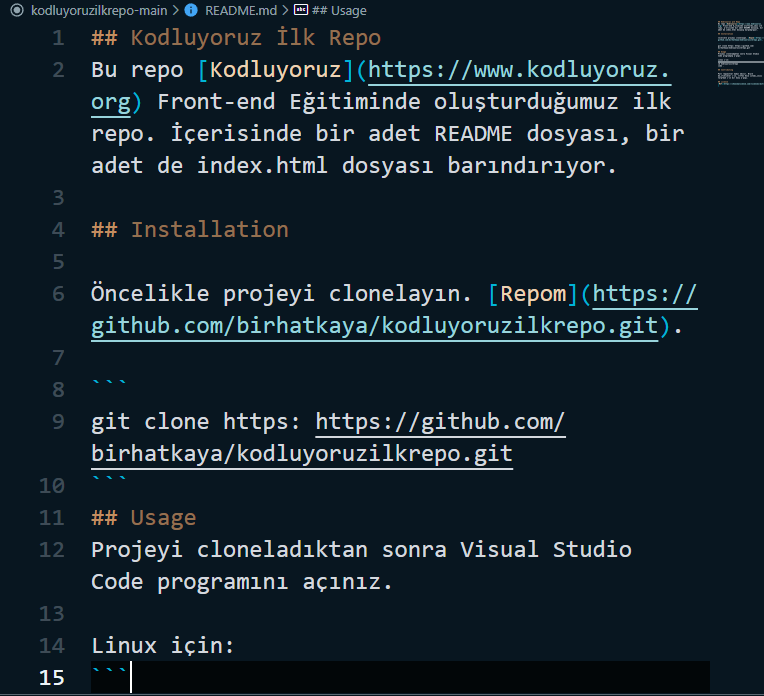

## Kodluyoruz İlk Repo
Bu repo [Kodluyoruz](https://www.kodluyoruz.org) Front-end Eğitiminde oluşturduğumuz ilk repo. İçerisinde bir adet README dosyası, bir adet de index.html dosyası barındırıyor.

## Installation

Öncelikle projeyi clonelayın. [Repom](https://github.com/birhatkaya/kodluyoruzilkrepo.git).

```
git clone https: https://github.com/birhatkaya/kodluyoruzilkrepo.git
```
## Usage
Projeyi cloneladıktan sonra Visual Studio Code programını açınız.

Linux için:
```
cd kodluyoruzilkrepo
code .
```
## Contributing

Pull requestler kabul edilir. Büyük değişiklikler için, lütfen önce istediğinizi tarışmak için bir konu açınız.

## License 
[MIT](https://choosealicense.com/licenses/mit/)

